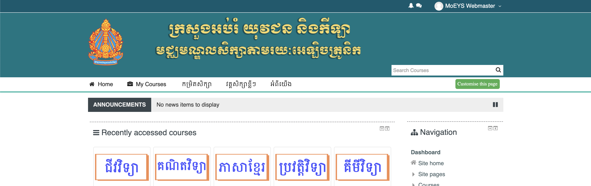

# MoEYS Moodle Theme
This is a Moodle Theme customized for MoEYS extended from Adaptable theme.

## Adaptable - the most adaptable moodle theme
===========================================

Version 2.2.2 (2019112601)

Adaptable is a highly customizable responsive two column moodle theme based on the popular BCU theme adding:

- Customizable fonts (Google Fonts)
- Fully customizable colors
- Fully customizable block styles (including FA icons)
- Fully customizable buttons
- Additional header navigation
- News Ticker
- Alternative jQuery slider
- Alternative front page course styles
- Additional customizable marketing blocks
- Additional layout settings for width, slider width, padding of
  various elements
- Social icons
- Mobile settings (customize how theme looks on mobile devices)
- Dismissible bootstrap alerts
- Option to add login form in header on front page
- Logo and Favicon uploader
- Modern emojis (thanks to EmojiOne)
- Front Page layout builder
- Dashboard layout builder
- Course layout builder
- Activities status
- Privacy API (compatible with GDPR)
- 2 and 3 row header style options
- 2 User profile layouts

In addition many fields (menus, news items, alerts and help links) can be targeted using custom profile fields, thus it is possible
to present different users with different navigation items and notices. It is also possible for individual users to customize where
they want top menu navigation to appear (disable, home pages only, site wide) using custom profile fields.

Adaptable has a lot of settings and may seem daunting at first, our advice is to simply install with the default settings and play
with it afterwards.

With a little time you should be able to setup an attractive Moodle site with a high degree of individuality without without
knowing any CSS.

This theme has been developed by:
Lead Developers
Jeremy Hopkins (Coventry University)
Fernando Acedo (3bits elearning solutions)
Manoj Solanki (Coventry University)

## Change Log in 2.2.2
------------------------------------

Main fixes & Enhancements done in this release.

- Fix mobile responsive settings in "layout responsive" settings page
- Fix ability to set general box color in forums
- Fix issues with login page when no header in use
- Fix issue of footer riding up on short pages with little content
- Fix close icon for activity chooser in Moodle 3.8
- Fix combo list on mobile, now collapses into single column

What's new?

- Layout responsive settings page
- Setting to control color of forum "general box" background where forum description is displayed

## HTML/CSS sample code for block areas
------------------------------------
Here you will find some code samples to help you to customize the Info Box and the Marketing Blocks.

You can insert any HTML tag to customize the front page blocks. Use a 
 tag as a main container and add the height to keep the
same value in all the blocks.

The Font Awesome icons set is available in
http://fortawesome.github.io/Font-Awesome/icons/.

You can insert any of them following the examples
http://fortawesome.github.io/Font-Awesome/examples/
